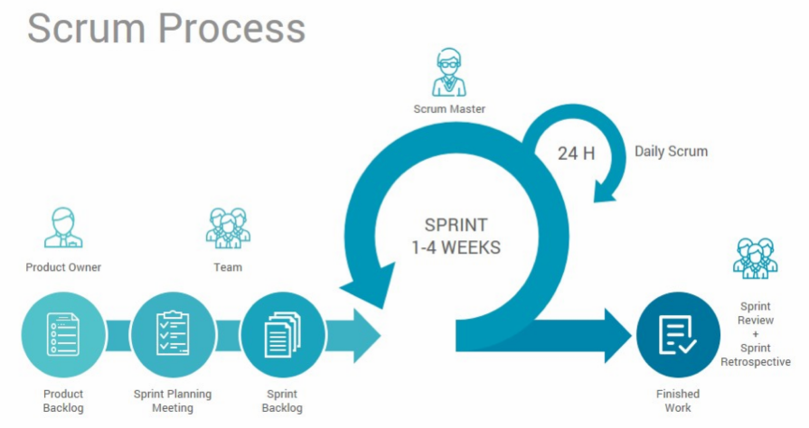
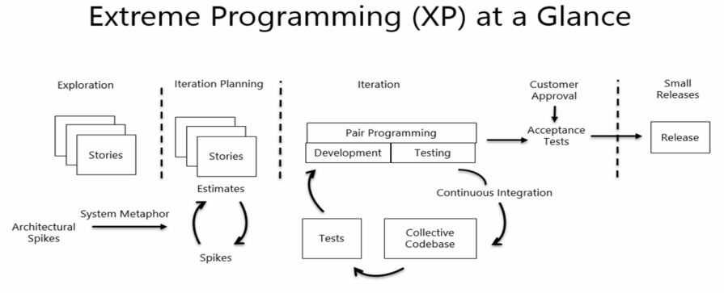

# __Summary__  

# 1. Culture  

## 1.1 History  

### 20世纪80年代后期  

Roy Singham成⽴了Singham Business Services，为芝加哥地下室的设备租赁⾏业提供服务  

### 1993年  

以新名称ThoughtWorks注册成⽴  

### 2001年  

Martin Fowler，Jim Highsmith等⼈⼀起撰写了敏捷宣⾔ 

### 2010年  

CTO Parsons被评为Fast Company的“技术最具影响⼒的⼥性”之⼀  

### 2013年

David Walton博⼠被聘为全球健康总监，领导在资源贫乏环境中服务于医疗机构技术需求的实践  

## 1.2 3 PILLARS  

### PILLAR 1：经营可持续的业务  

* 咨询服务：IT组织优化，技术咨询，测试策略，客户体验  
* 构建定制化系统和定制化产品：和客户⼀起完成极其复杂的项⽬和软件，尽可能快速地将概念转化为价值  

### PILLAR 2：推动IT变⾰，追求软件卓越  

* 技术雷达：ThoughtWorks每年都会出品两期技术雷达，这是⼀份关于技术趋势的报告，它以雷达形式对各类最新技术的成熟度进⾏评估并给出建议。它不仅涉及到新技术⼤趋势，更有细致到类库和⼯具的推荐和评论，因此更容易落地。  
* 敏捷宣⾔：Martin Fowler & Jim Highsmith  
* 出版著作：《重构——改善既有代码的设计》

### PILLAR 3：积极提倡社会和经济公正

* 社会公正⼯作  
* 招聘和多样性：《你我同行》；群岛加速器

## 1.3 我们的使命

通过软件创造⼈类更美好的明天，倡导社会责任感，创造公平公正的经济环境。

## 1.4 HOW DO WE WORK

* Open：个⼈开放学习交流，公司信息透明    
* Feedback：帮助他⼈和公司成⻓

# 2. Agile Methodology

## 2.1 软件危机和软件工程

* 软件危机是指落后的软件生产方式无法满足迅速增长的计算机软件需求，从而导致软件开发与维护过程中出现一系列严重问题的现象。  
* 软件工程的提出就是为了解决软件危机。

## 2.2 软件工程方法

* 瀑布模型：是第一个软件工程方法，也叫顺序线性方法。瀑布模型是将软件生存周期的各项活动规定为按固定顺序而连接的若干阶段工作，形如瀑布流水，最终得到软件产品。
* 原型模型：原型模型又叫快速原型模型，它指的是在执行实际软件的开发之前，快速建立系统的一个工作原型，通过向用户提供原型获取用户的反馈，使开发出的软件能够真正反映用户的需求。
* 增量模型：增量模型是把待开发的软件系统模块化，将每个模块作为一个增量组件，从而分批次地分析、设计、编码和测试这些增量组件。
* 螺旋模型：螺旋模型采用一种周期性的方法来进行系统开发，它将瀑布模型和快速原型模型结合起来，强调了其他模型所忽视的风险分析。
* 重量级方法：强调以开发过程为中心。重量级方法呈现的是一种“防御型”的姿态。在应用“重量级方法”的软件组织中，由于软件项目经理不参与或者很少参与程序设计，无法从细节上把握项目进度，因而会对项目产生“恐惧感”，不得不要求程序员不断撰写很多“软件开发文档”。
* 轻量级方法：强调以人为中心。轻量级方法呈现“进攻型”的姿态，这一点从XP方法特别强调的四个准则“沟通、简单、反馈和勇气”上有所体现。
* ISO：ISO9000标准是国际标准化组织（ISO）在1994年提出的概念，是指“由ISO/Tc176（国际标准化组织质量管理和质量保证技术委员会）制定的国际标准。ISO9000标准是建立在"所有工作都是通过过程来完成的"这样一个认识基础之上。ISO 9000-3作为软件企业实施ISO 9001的指南，其主要思想是：软件的开发和维护有着一系列的任务。这些任务的顺利完成是需要各级管理层和开发人员的共同配合和一致协调的。
* CMM：CMM模型指“能力成熟度模型”。它是对于软件组织在定义、实施、度量、控制和改善其软件过程的实践中各个发展阶段的描述。CMM的核心是把软件开发视为一个过程，并根据这一原则对软件开发和维护进行过程监控和研究，以使其更加科学化、标准化、使企业能够更好地实现商业目标。

## 2.3 敏捷方法

敏捷方法就是轻量级方法的大融合

## 2.4 敏捷宣言

    雪鸟会议共同起草了敏捷软件开发宣言。   

我们一直在实践中探寻更好的软件开发方法，身体力行的同时也帮助他们。由此我们建立了如下价值观：  

__个体和互动__ 高于 _流程和工具_  
__工作的软件__ 高于 _详尽的文档_  
__客户合作__   高于 _合同谈判_  
__响应变化__   高于 _遵循计划_   

也就是说，尽管右项有其价值，我们更重视左项的价值。

## 2.5 敏捷方法的具体实现

### Scrum

Scrum是迭代式增量软件开发过程，通常用于敏捷软件开发。Scrum包括了一系列实践和预定义角色的过程骨架。Scrum中的主要角色包括同项目经理类似的Scrum Master角色负责维护过程和任务，产品负责人代表利益所有者，开发团队包括了所有开发人员。虽然Scrum是为管理软件开发项目而开发的，它同样可以用于运行软件维护团队，或者作为计划管理方法：Scrum of Scrums。

### 极限编程（XP）

极限编程是由KentBeck在1996年提出的，它强调程序设计团队与业务专家之间的紧密协作、面对面的沟通（比书面的文档更有效）、频繁交付新的软件版本、紧凑而自我组织型的团队、能够很好的适应需求变化的代码编写和团队组织方法，更注重软件开发中人的作用。

### 站会（Stand up）

站会就是一种与会者都站着的会议。长时间的不舒服的站着，是为了保证会议能够比较短。

### 迭代会议（Iteration Plan Meeting）

1. 迭代计划会在每个迭代的第一天召开，目的是选择和评估本次迭代的工作项。

2. 产品负责人逐条讲解最重要的产品功能。

3. 开发团队共同估算故事所需的工作量。直到本次迭代的工作量达到饱和。

4. 产品负责人参与讨论并回答与需求相关的问题，但不干涉估算结果。

 ### 回顾会议（Retrospective）

见后文第4节的介绍

### 代码评审（Code Diff/Review）

代码评审也称代码复查，是指通过阅读代码来检查源代码与编码标准的符合性以及代码质量的活动。

# 3. Feedback  

## 3.1 什么是Feedback  

* 个体和互动高于流程和⼯具  
* 某个⼈对你“示爱”

## 3.2 为什么要Feedback  

* 帮助他人   
* 提升自己  
* 追求卓越  

## 3.3 反馈的套路-SBI

* 在什么情况下（Situation）
* 观察到的⾏为（Behavior）
* 造成的影响（Impact）
* 反思（Reflection）（可选）

## 3.4 具体方法

### 基于行为

* 通用句式：我看到了。。。想找你确认下

### 对话

* 通用句式：有空吗？想找你聊一下，找个安静的地方可以吗？  

### 不要激进

* 通用句式：我观察到。。。我猜测是。。。想跟你确认下是这样吗?

### 安全私人的环境

* 通用句式：我们找个会议室吧

### 越早越好

### 不要太多

### 可执行的Action

### 支持对方

## 3.4 给Feedback的公式

特定的 __时间__ +
观察到的 __行为__ + 
你的 __感受__ +
平等、私⼈的 __对话__ +
可执行的 __建议__ +
持续 __支持__

## 3.5 如何接受反馈

### 不要抗拒

### 有效倾听

* 反馈时间不要太⻓
* 内容聚焦
* 沟通场景⼀致
* 最终结果⼀致

### 表达谢谢

### 采取行动

### 回顾⼀下

* 保持开放的态度
* 不采取防御的态度
* 感谢对⽅帮助⾃⼰提⾼和成⻓
* 积极付出⾏动去提升

# 4. Retro

## 4.1 基本概念

### 目的

* 团队通过对本迭代的⼯作过程进⾏回顾，分析团队的改进空间，回顾会是保持团队持续改善的重要⼯具。

### 时机

* 在下个迭代的计划会议之前开展，例如迭代最后⼀周的周五下午，时⻓不超过2⼩时。

### 参与者与职责

* 全体团队成员，SM组织

### 流程步骤

1. 会前收集迭代过程的数据，包括但不限于未完成的⽤户故事、燃尽图、迭代产能、质量数据、 业务数据变化、活动执⾏效果数据等
2. 会前，团队成员应清晰明确迭代⽬标的达成情况
3. 会议⼀开始，团队⾸先回顾本迭代的过程和收集的数据
4. 团队就上个迭代的运作情况采⽤头脑⻛暴⽅式提出有哪些是做得好的、不好的、以及问题
5. 团队就不好的⽅⾯，集体制定改进建议，并制定⾏动措施和计划
6. 团队成员认领改进措施，在后续迭代内跟进措施的执⾏情况

### 产出

* 团队的改进Backlog（包括改进点和负责⼈）、团队更新的⼯作协议

## 4.2 原则

* Scrum Master要引导团队整体产⽣改进建议和制定措施，不是⾃⼰
发⽣问题，⾃⼰制定措施
* 回顾会议对事不对⼈，不要演变成批⽃会
* 回顾会议要营造⼀个开放、⾃由、正向的⽓氛，不要演变成吐槽会
* 好的，不好的地⽅，都应以实例来说明，⽽⾮感觉
* Action应该是在下个迭代就能看到成效，且必须有Owner
* Action由SM纳⼊到团队的待办事项列表中

## 4.3 具体实践

* Well：好的方面，贴纸条
* Less well：不好的方面，贴纸条
* Suggestion：提出建议，贴纸条
* Action：具体的行动，落实到个人